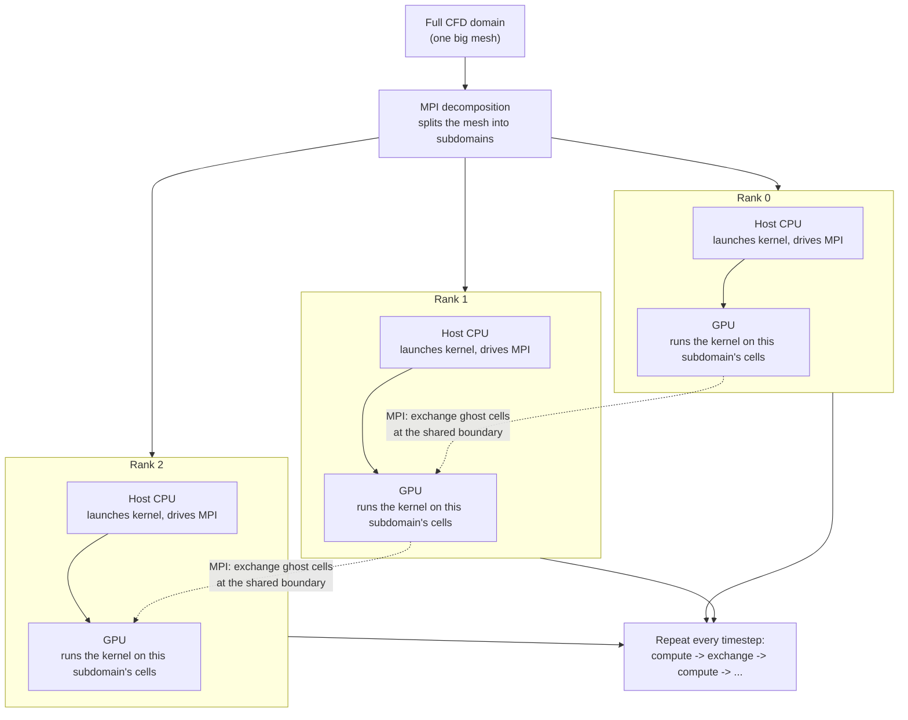

# GPUs, Multithreading, and MPI: How a CFD Simulation Actually Runs

*A companion to `0001-phase0-execution-foundation.md`. Builds on its vocabulary*
*(worker, kernel, thread, ghost cell) — read that first if those are*
*unfamiliar. This one zooms out: from "one GPU running one kernel" to "many*
*GPUs, on many separate computers, jointly solving one simulation."*

---

## Slide: Quick recap, so we're starting from the same place

- A **kernel** is one small calculation, repeated once per mesh cell (e.g.
  "update this cell's temperature").
- A **thread** is one worker executing that calculation, for one cell.
- A GPU is built from thousands of these workers, running the same kernel
  on thousands of cells at once.
- A **ghost cell** is a fake extra cell at the edge of the mesh that lets
  every real cell run the exact same kernel, boundary cells included,
  without special-casing code.

(All of this is covered in more depth in `0001-phase0-execution-foundation.md`.)

---

## Slide: What actually makes a GPU different from a CPU?

- A CPU has a handful of workers (think: 8-64), each one very capable — it
  can juggle many different, complicated tasks, one after another, very
  quickly.
- A GPU has thousands of workers, but each one is much simpler — it's
  built to do one simple thing, over and over, at the same time as
  thousands of others doing the exact same thing.
- Analogy: a CPU is a handful of expert chefs, each able to cook any dish
  on the menu. A GPU is a factory assembly line with thousands of workers,
  each trained to do exactly one repetitive motion — but doing it to
  thousands of parts simultaneously.
- CFD is, for the most part, exactly the assembly-line kind of problem:
  the same small calculation, repeated identically across millions of
  cells. That's why GPUs are so effective for it.

---

## Slide: One GPU isn't enough

- A real reacting-flow simulation might need millions of cells. Even the
  biggest single GPU has a limited amount of memory and a limited number
  of workers.
- So for large simulations, we don't run on one GPU — we split the
  *simulated domain itself* into pieces, and give each piece to a
  different GPU, often on a different physical computer entirely.
- This splitting is called **domain decomposition**, and the pieces are
  called **subdomains**.

---

## Slide: MPI — how separate computers talk to each other

- Threads on one GPU (or one CPU) all share the same memory — one worker
  can just "look over" and read what another one wrote.
- Separate computers don't share memory at all. If computer A needs a
  number that computer B just calculated, B has to explicitly *send* it
  over the network, and A has to explicitly *receive* it.
- **MPI** (Message Passing Interface) is the standard, decades-old toolkit
  for doing exactly that sending and receiving between separate copies of
  a running program.
- Analogy: threads within one GPU are like people in the same room, who
  can just glance at each other's notes. MPI is like separate offices in
  different cities — nothing is shared automatically; every update has to
  be mailed.
- Each separate copy of the running program is called a **rank** (rank 0,
  rank 1, rank 2, ...) — one rank per subdomain, typically one rank per
  GPU.

---

## Slide: Reusing a trick you already know — ghost cells, again

- Here's the elegant part: a subdomain's edge needs the exact same fix a
  domain's edge did — **ghost cells**.
- Each subdomain gets a thin layer of ghost cells that mirror its neighbor
  subdomain's real cells, right at the shared boundary.
- The only difference from before: instead of a boundary-condition formula
  filling those ghost cells (a fixed value, or wrapping around
  periodically), an **MPI message** fills them — carrying the neighbor's
  real, just-computed cell values across the network.
- Same seam in the code, different thing filling it. That's a deliberate
  design choice, not a coincidence, specifically so this reuse is possible
  without redesigning anything later.

---

## Slide: Putting it together — one GPU per subdomain, a CPU in charge

- The common pattern: **one MPI rank per GPU.** Each rank owns one
  subdomain, computed entirely on its own GPU.
- Each rank also has a **host CPU** attached to its GPU. The host CPU
  doesn't do the heavy per-cell math — the GPU does that — but it's in
  charge of:
  1. launching the GPU's kernel over its subdomain's cells, every
     timestep;
  2. after the kernel finishes, packaging up the freshly-computed boundary
     cells and sending them via MPI to neighboring ranks;
  3. receiving neighboring ranks' boundary cells back, and writing them
     into its own ghost cells.
- Then it repeats: compute -> exchange -> compute -> exchange, once per
  simulated timestep, for as many timesteps as the simulation runs.

---

## Slide: The whole picture, as a flow chart



- Each box in the middle row is a **separate physical computer** (or at
  least a separate GPU), running its own independent copy of the program.
- The dashed arrows are the only communication between them — and they
  only ever carry ghost-cell data, nothing else.

---

## Slide: Why this matters for where CMU-CFE is headed

- This exact hierarchy is already the project's stated execution model
  (see `README.md`):

  ```text
  Distributed domain
      -> MPI partition
          -> local cells/faces
              -> CPU threads or accelerator threads
  ```

- Phase 1 (in progress) builds the ghost-cell infrastructure this all
  depends on — for domain boundaries only, for now.
- Phase 2 is where MPI decomposition and multi-GPU communication actually
  get built and benchmarked, reusing that same ghost-cell seam.

---

## Slide: Be clear about what's general knowledge vs. what's still undecided

Everything above this slide is how GPU/MPI/CFD systems typically work in
general — true regardless of what CMU-CFE ends up building. It is **not**
a description of a feature that already exists in this codebase, and it
is not a set of decisions that have actually been made yet. Phase 2 is
where these get decided, and per this project's own rule (`AGENTS.md`:
"never call code optimized without measurement"), they get decided with
benchmark evidence, not assumed in advance. Specifically still open:

- **How the mesh actually gets cut into subdomains.** Simple contiguous
  slabs (easiest to implement, possibly uneven load) vs. a more careful
  partitioning that balances work per rank — undecided.
- **Whether it's really "one rank per GPU."** That's the common pattern
  in the field and the one this document uses to explain the concept, but
  whether CMU-CFE's first prototype matches it, or uses some ranks
  sharing a GPU, or multiple GPUs per rank, is a Phase 2 design/benchmark
  question, not a settled fact.
- **CPU-mediated vs. GPU-direct communication.** The diagram above shows
  the simpler, CPU-mediated picture. Whether CMU-CFE starts there and
  stays there, or eventually moves to direct GPU-to-GPU communication, is
  unknown and will depend on what the communication benchmarks
  (`BENCHMARKS.md`'s communication-benchmark class) actually show.
- **How much communication overlaps with computation.** Doing the halo
  exchange *while* the GPU keeps computing on cells that don't need it
  yet is a real, common optimization — but whether it's needed here, and
  how much it would help, is unmeasured.
- **Load balancing.** If subdomains end up different sizes or different
  amounts of work, some ranks could sit idle waiting on slower ones. Not
  yet addressed, not yet known to matter.

None of this is a gap in the explanation above — it's the honest state of
a system that Phase 2 hasn't built yet. The point of this document is to
make the *concepts* clear so that whatever Phase 2 actually decides, the
reasoning behind it is legible to everyone in the room, not to pre-answer
Phase 2's design questions.
