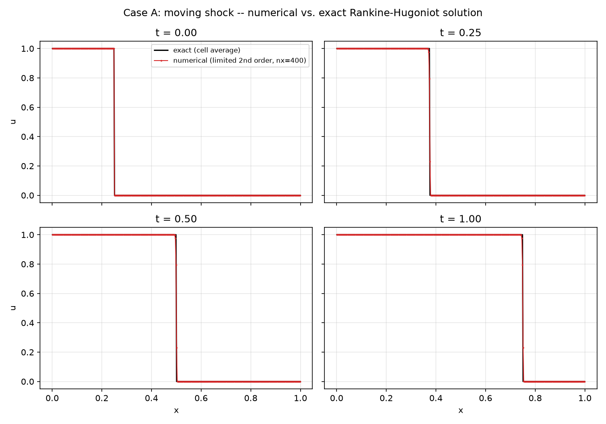
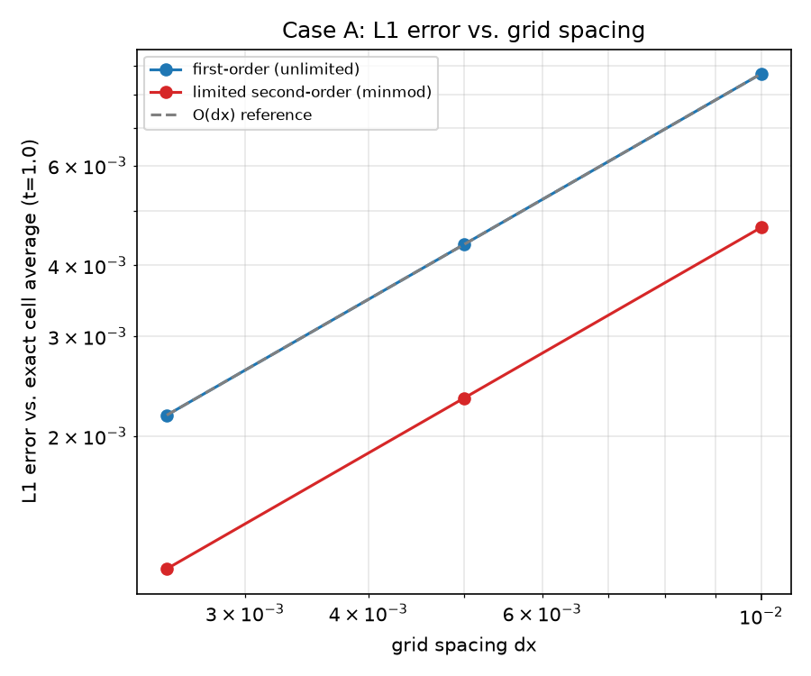
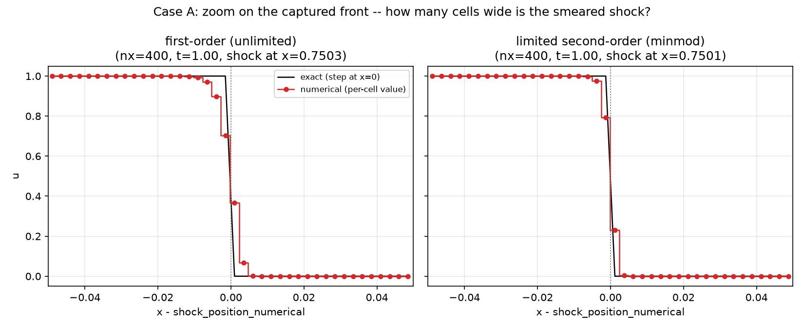
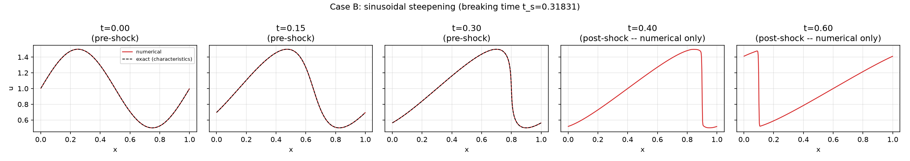
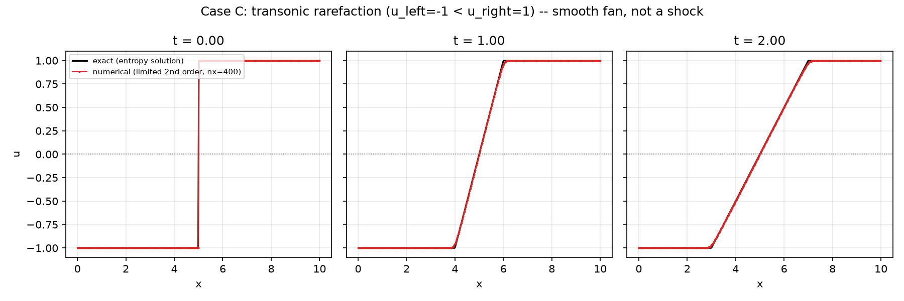

# Tutorial: 1D Burgers -- moving shock and sinusoidal steepening

Solves the inviscid Burgers equation `u_t + (u^2/2)_x = 0` on `x in
[0,1]`, using the exact same `FvmSolver` + `BurgersField` +
`RusanovFlux` + SSP-RK2 stack every other Burgers tutorial in this repo
uses. Ghost cells are refreshed by `solver.residual()` on every single
residual evaluation, at every RK stage -- the default behavior that
stack already has, since neither case's boundary values depend on
wall-clock time (see `tutorials/burgers_2d_diagonal_shock/` for the one
tutorial where that genuinely matters and the generic
`cfe::ssp_rk2_step` is not used for exactly that reason).

Two selectable cases:

## Case A: moving shock

Initial condition `u=1` for `x<0.25`, `u=0` elsewhere; fixed inflow
(`u=1`) at the left, zero-order extrapolation ("outflow") at the right
(`InflowOutflowBoundary`, `src/cfe/grid/boundary/boundary_condition.hpp`).
The exact solution is a single shock at `x_s(t) = 0.25 + 0.5t`
(Rankine-Hugoniot, exact for Burgers' convex flux -- same relation
`tests/unit/test_burgers_shock_formation.cpp` verifies). Run at three
grid resolutions (100, 200, 400 cells) and two reconstructions
(`FirstOrderReconstruction`, piecewise-constant; `MusclMinmodReconstruction`,
the limited second-order scheme every other Burgers tutorial uses),
compared against the **exact cell average** at each output time --
including cells the shock itself currently straddles, via a closed-form
fractional-coverage formula (`shock_exact_cell_average`), not a
cell-center 0/1 guess.





The convergence plot's `O(dx)` reference line is not a mistake: a
captured shock is smeared over a handful of cells regardless of
resolution, so even the *limited second-order* scheme's L1 error only
drops at first order here (consistently about half the first-order
scheme's error at matching resolution) -- this is a well-known,
expected property of shock-capturing schemes at an actual discontinuity,
not a sign the limiter isn't working (see
`docs/adr/0008-burgers-shock-capturing-scheme.md` and
`tests/unit/test_burgers_shock_formation.cpp`'s own header comment for
the same point made about the production test).

The plot below is *why*: it zooms in on the final time's (`t=1.0`,
`nx=400`) captured front, re-centered on each scheme's own
numerically-detected shock location (`summary.csv`'s own
`shock_position_numerical`) so both panels' `x=0` means "the shock,
here" despite the two schemes landing at very slightly different
positions -- the `+/-0.05` window is only 40 cells wide at this
resolution, so individual cell values are visible as discrete points,
not just a smooth-looking line.



First-order smears the transition over roughly 4-5 cells; the limited
second-order (minmod) scheme captures it in roughly 2-3 -- visibly
sharper, even though (per the convergence plot above) both still
converge at the same O(dx) *rate* right at the discontinuity itself.

## Case B: sinusoidal steepening

Initial condition `u0(x) = 1 + 0.5*sin(2*pi*x)`, periodic boundaries.
Smooth now, but Burgers' characteristic speed is the local state value
itself, so this profile steepens and forms a genuine shock at the exact,
closed-form breaking time `t_s = -1/min(u0') = 1/(2*pi*0.5) = 1/pi ~=
0.31831`. Only the limited second-order scheme is run here (the task
this tutorial follows does not ask for a first/second-order comparison
on this case).



**Exact vs. numerical, explicitly:** for `t < t_s` (the first three
panels), the exact reference is the method-of-characteristics solution
(`x = xi + u0(xi)*t`, `u = u0(xi)`, solved by bisection -- see this
file's own comment in `burgers_1d.cpp` for why bisection and not Newton's
method, which was tried first and found to misbehave very close to
`t_s`). **For `t >= t_s` (the last two panels), no exact reference is
computed or plotted at all** -- constructing a genuinely
entropy-satisfying post-shock reference (an equal-area/Whitham
construction) is a separate, nontrivial undertaking, and the task this
tutorial follows explicitly says not to use multivalued characteristics
as a stand-in. Those panels show numerical results only, labeled as
such in the plot title.

Checked at every output time (not just claimed): the domain mean stays
exactly `1.0` (conservation on a periodic domain), and the solution
never leaves `[0.5, 1.5]` (the initial condition's own min/max -- the
TVD guarantee holding even past shock formation).

## Case C: transonic rarefaction

Initial condition `u_left=-1` for `x<5`, `u_right=1` for `x>5`, fixed
far-field values on both ends (`StaticBoundary`) -- the opposite
ordering from Case A's shock, so the Lax entropy condition selects a
smooth **rarefaction fan** instead: `u(x,t) = u_left` for
`(x-5)/t < -1`, `= (x-5)/t` for `-1 <= (x-5)/t <= 1`, `= u_right` for
`(x-5)/t > 1` (exact, self-similar). This case is specifically
**transonic**: the fan's own center is exactly where the characteristic
speed crosses zero, a genuine sonic point sitting inside the domain --
the exact scenario `numerics/numerical_flux/upwind.hpp`'s own header
comment names as the gap `UpwindFlux` cannot handle (no well-defined
upwind side right at a sonic point) and `RusanovFlux` exists to close.
This is the direct, end-to-end confirmation of that design choice, not
just another Riemann problem.



The fan grows smoothly and symmetrically (span `[5+u_left*t, 5+u_right*t]`
= `[4,6]` at `t=1`, `[3,7]` at `t=2`), staying well clear of both
boundaries for the whole run, and passes cleanly through `u=0` at its
center with no spurious jump or glitch -- the actual transonic-
correctness criterion, not just "the numbers are close." Checked
directly (not just plotted): the solution never leaves `[-1,1]`, L1
error against the exact cell-average solution drops under grid
refinement, and the domain integral stays unchanged to within floating-
point tolerance for the whole run -- a clean, exact-zero conservation
check specific to this symmetric choice of far-field values (Burgers'
flux is `u^2/2`, so `F(-1)=F(1)=0.5`, making the net boundary flux
exactly zero despite this domain not being periodic). `dt` is sized from
`max(|u_left|,|u_right|)`, not a signed state value -- `u_left` is
negative here, so Case A's own `dt = cfl*dx/u_left` pattern (safe only
because Case A's `u_left` happens to be positive) would give a negative
timestep.

## Build and run

From the repo root (builds everything else too):

```bash
cmake -S . -B build -DCMAKE_BUILD_TYPE=Release
cmake --build build --target cfe_burgers_1d -j
cd tutorials/burgers_1d_shock_and_steepening
../../build/tutorials/burgers_1d_shock_and_steepening/cfe_burgers_1d
```

Or standalone, from this directory alone:

```bash
cmake -S . -B build -DCMAKE_BUILD_TYPE=Release
cmake --build build --target cfe_burgers_1d -j
./build/cfe-root-build/tutorials/burgers_1d_shock_and_steepening/cfe_burgers_1d
```

`cmake --build build -j` with no `--target` builds the *whole* project
(every test, benchmark, and tutorial), not just this one -- see
`tutorials/CMakeLists.txt`'s own comment for why pulling in the repo
root this way always does that. Run with `--case=shock`,
`--case=steepening`, or `--case=rarefaction` to run just one case; no
argument runs all three (what this README's own regeneration commands
below do).

Writes `data/summary.csv` (every grid/case/reconstruction/time row --
the single source of truth for every number reported above) plus the
committed field CSVs this README embeds plots of.

## Regenerating the figures

```bash
python3 -m venv .venv && source .venv/bin/activate  # optional but recommended
pip install numpy pandas matplotlib
./build/tutorials/burgers_1d_shock_and_steepening/cfe_burgers_1d   # from the repo root; or run the binary built above
python3 plot_results.py
```

Dependencies: `numpy`, `pandas`, `matplotlib`.

## What is committed vs. regenerated

`data/` holds `summary.csv` in full (every grid/case/reconstruction/time
-- small, just numbers) plus field CSVs for ONE representative grid per
case: Case A's finest grid (400 cells), at all four output times, for
**both** reconstructions (needed for the shock-capturing zoom-in plot to
compare them side by side); Case B's single grid (400 cells, no
resolution sweep is requested for this case), limited second-order only,
at all five output times; Case C's single grid (400 cells, same
reasoning as Case B -- the grid-convergence claim is already proven by
`tests/unit/test_burgers_rarefaction.cpp`, this tutorial is for the
profile plot), limited second-order only, at all three output times.
This is enough for `plot_results.py` to
reproduce every figure in this README out of the box, without re-running
the C++ binary -- but running it (as shown above) regenerates the exact
same files, plus every other grid/reconstruction combination `summary.csv`
reports on, which are not individually committed.
