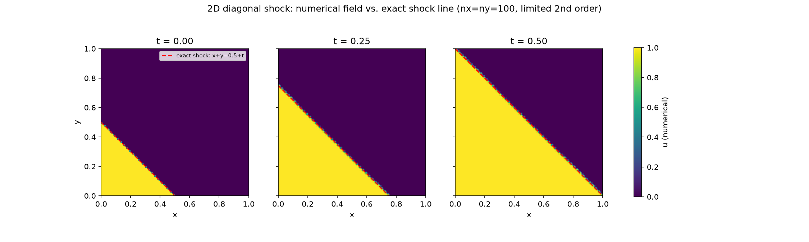
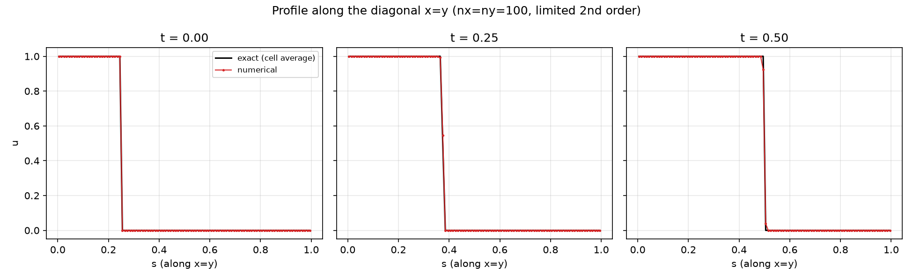
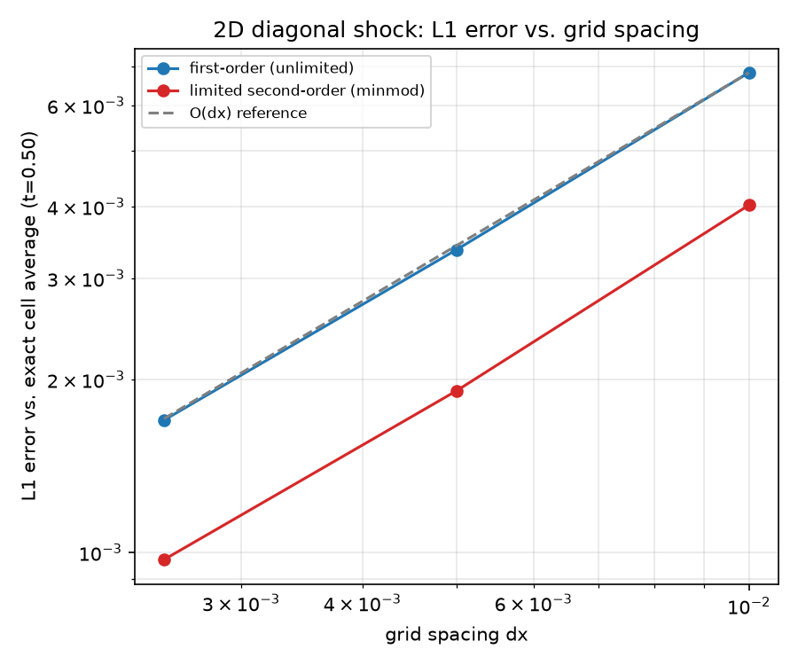

# Tutorial: 2D Burgers -- diagonal moving shock

Solves the 2D inviscid Burgers equation `u_t + (u^2/2)_x + (u^2/2)_y =
0` on `(x,y) in [0,1]x[0,1]`, using the same `FvmSolver` +
`BurgersField<Scalar,2>` + `RusanovFlux` stack every other Burgers
tutorial in this repo uses -- with one genuine difference, explained
below.

## The problem

Initial condition: `u=1` where `x+y<0.5`, `u=0` elsewhere. Because this
is a pure translation along the direction perpendicular to the initial
line (a 1D Riemann shock embedded diagonally in 2D), the exact solution
at any time is just that same line advancing: `u=1` where `x+y<0.5+t`,
`u=0` elsewhere -- a shock that stays perfectly straight and tracks
`x+y=0.5+t` for all time.







Run at three grid resolutions (100^2, 200^2, 400^2 cells) and both
reconstructions (`FirstOrderReconstruction`, `MusclMinmodReconstruction`),
compared against the **exact cell average** at each output time --
including cells the diagonal shock line itself cuts through, via a
closed-form area-fraction formula for a square clipped by a slope -1
line (`cut_cell_fraction`). The same convergence caveat as the 1D
tutorial's Case A applies: a captured shock's L1 error drops at first
order regardless of reconstruction (the limited second-order scheme is
consistently better at the same resolution, but not at a different
*rate*) -- see `docs/adr/0008-burgers-shock-capturing-scheme.md`.

## Why this tutorial does NOT use `cfe::ssp_rk2_step`

Ghost cells here are populated directly from the *known exact solution*
(not from neighboring interior state), and that exact solution moves
with `t`. `cfe::ssp_rk2_step` has no time parameter -- it is not
modified here (zero blast radius on that shared, already-reviewed
helper used throughout the rest of this repo) -- so this tutorial writes
out Heun's method (SSP-RK2's two stages) explicitly in `burgers_2d.cpp`,
setting a boundary instance's own `time` member to the correct stage
time (`t_n` before the first residual evaluation, `t_n+dt` before the
second) between the two stages. This is the literal textbook scheme the
shared helper already encodes, written by hand specifically so the
stage time can reach the boundary -- see `step_once(...)` and
`DiagonalShockExactBoundary` in `burgers_2d.cpp` for the actual code,
and that struct's own header comment for why it is tutorial-local
rather than added to the generic boundary-condition library (it
hardcodes this one problem's exact solution formula).

## Build and run

From the repo root (builds everything else too):

```bash
cmake -S . -B build -DCMAKE_BUILD_TYPE=Release
cmake --build build --target cfe_burgers_2d -j
cd tutorials/burgers_2d_diagonal_shock
../../build/tutorials/burgers_2d_diagonal_shock/cfe_burgers_2d
```

Or standalone, from this directory alone:

```bash
cmake -S . -B build -DCMAKE_BUILD_TYPE=Release
cmake --build build --target cfe_burgers_2d -j
./build/cfe-root-build/tutorials/burgers_2d_diagonal_shock/cfe_burgers_2d
```

`cmake --build build -j` with no `--target` builds the *whole* project,
not just this one -- see `tutorials/CMakeLists.txt`'s own comment for
why. The 400^2 grid is the slowest case; the full sweep (all
grids x both reconstructions) takes well under a minute on a laptop.

Writes `data/summary.csv` (every grid/reconstruction/time row -- the
single source of truth for every number reported above) plus the
committed field/diagonal-profile CSVs this README embeds plots of.

## Regenerating the figures

```bash
python3 -m venv .venv && source .venv/bin/activate  # optional but recommended
pip install numpy pandas matplotlib
./build/tutorials/burgers_2d_diagonal_shock/cfe_burgers_2d   # from the repo root; or run the binary built above
python3 plot_results.py
```

Dependencies: `numpy`, `pandas`, `matplotlib`.

## What is committed vs. regenerated

`data/` holds `summary.csv` in full (every grid/reconstruction/time --
small, just numbers) plus a full-grid field dump and a diagonal (`x=y`)
profile, at every output time, for ONE representative combination: the
**smallest** grid (100^2) with the limited second-order reconstruction.
This is the opposite choice from the 1D tutorial's "finest grid"
convention, deliberately: a full 2D field dump grows with `N^2`, not
`N`, so committing the 400^2 case would cost roughly 16x the repository
space for a plot that looks essentially identical at this resolution --
100^2 is still a clearly-legible color map and keeps `data/` under
1 MiB. Running the program (as shown above) regenerates the exact same
files, plus every other grid/reconstruction combination `summary.csv`
reports on, which are not individually committed.
