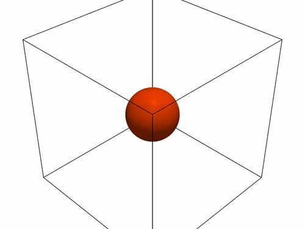

# Tutorial: 3D MPI Burgers strong scaling

Task 0006 added the `MPI_Allreduce(MAX)` fix (`backend/mpi/
mpi_reduce.hpp`) that makes `BurgersField` safe to decompose, and
proved it correct with `tests/mpi/test_mpi_burgers_steepening.cpp`.
This tutorial is the visual/quantitative follow-up: the same
`FvmSolver` + `BurgersField<Scalar,3>` + `MusclMinmodReconstruction` +
`RusanovFlux` + SSP-RK2 stack `tutorials/burgers_3d_visualization/`
already uses, decomposed across an increasing MPI rank count, both
**running correctly** (a shock forms and crosses rank boundaries
cleanly) and **scaling** (more ranks finish the same fixed problem
faster) -- the direct sibling of `tutorials/
mpi_scalar_advection_3d_strong_scaling/`, read that one first for the
strong-vs-weak-scaling background this README doesn't repeat.

## What it does

A Gaussian bump (`state = 1.0 + 0.5*exp(-r^2/(2*0.12^2))`, identical IC
and constants to `tutorials/burgers_3d_visualization/`) is simulated on
a periodic 128^3 grid, decomposed across however many MPI ranks the
binary is launched with via `CartesianPartition` + `MpiHaloBoundary`
(task 0005). Unlike the linear scalar-advection sibling tutorial,
Burgers' characteristic speed is the local state itself, so the bump
does not just translate: its leading faces steepen into a shock, its
trailing faces spread into a smooth rarefaction fan -- independently
along all three axes at once.

Run to `t=1.2` -- about 3x the analytic shock-formation time for this
IC (`t_s = sigma / (amplitude*exp(-1/2)) ~= 0.396`, where a 1D slice's
steepest downhill gradient first reaches it). `tutorials/
burgers_3d_visualization/`'s own final time (`t~=0.521`) only just
clears that threshold, so its shock is barely formed; this tutorial
runs further past it specifically so the isosurface video below (and
the strong-scaling measurement) both see a clearly, fully-developed
front, not a borderline one. One side effect worth naming plainly: the
background state (`1.0`) self-advects too (Burgers' characteristic
speed is never zero here), so the *entire* domain drifts and wraps
around the periodic box by this final time -- see the video section
below for what that looks like and why it's correct, not a bug.

**This is also where task 0006's fix is directly exercised, not just
invoked for show**: the bump's peak sits inside only one (or a few, at
higher rank counts) rank's own local block, so most ranks see a
meaningfully smaller local `max|u|` than the true global one -- sizing
`dt` from the wrong, local-only value would desynchronize ranks' step
counts and hang the run (confirmed by deliberately breaking this in
task 0006's own correctness test). The one-line fix,
`cfe::backend::mpi::allreduce_max`, is what this file's own `dt`
computation calls before anything else.

Each rank writes **its own local block only** as a separate VTK file
(`frame_NNNN_rankNN.vtk`) using its true physical origin -- these tile
together exactly, same as the sibling tutorial (verified numerically
again for this tutorial, not just assumed from the shared machinery).
Opening the whole series in ParaView and watching it play lets you
**see** the shock crossing a rank boundary with no visible seam.

Wall-clock time for the whole run (compute + periodic VTK writes,
synchronized with `MPI_Barrier`) is printed as one CSV row per
invocation: `ranks,px,py,pz,global_n,n_steps,wall_clock_s`.

## Build and run

Requires `-DCFE_ENABLE_MPI=ON`.

```bash
cmake -S . -B build -DCMAKE_BUILD_TYPE=Release -DCFE_ENABLE_MPI=ON
cmake --build build --target cfe_mpi_burgers_3d -j
```

## Running in parallel

Same as the sibling tutorial: an ordinary MPI program, `-n` picks the
rank count, `(px,py,pz)` is chosen automatically. One run by itself:

```bash
mpirun -n 4 build/tutorials/mpi_burgers_3d_strong_scaling/cfe_mpi_burgers_3d
```

Add `--oversubscribe` (OpenMPI) if your machine has fewer cores than
the rank count requested -- correctness is unaffected, only timing.

**To measure strong scaling**, run that same command at several `-n`
values and collect the result:

```bash
cd tutorials/mpi_burgers_3d_strong_scaling
mkdir -p data
for np in 1 2 4 8; do
  mpirun -n $np ../../build/tutorials/mpi_burgers_3d_strong_scaling/cfe_mpi_burgers_3d \
    > /tmp/run_np${np}.out
  if [ "$np" -eq 1 ]; then
    grep -A1 '^ranks' /tmp/run_np${np}.out > data/summary.csv
  else
    grep -A1 '^ranks' /tmp/run_np${np}.out | tail -1 >> data/summary.csv
  fi
done
```

## Regenerating the figures

```bash
python3 -m venv .venv && source .venv/bin/activate  # optional but recommended
pip install numpy pandas matplotlib
python3 plot_results.py
```

Writes `figures/expected_scaling_reference.png` (conceptual, no data
needed -- see the sibling tutorial's README for what it means), plus,
once `data/summary.csv` exists, `figures/strong_scaling_time.png` and
`figures/strong_scaling_speedup.png`.

## Isosurface video



*(animated GIF for inline playback here -- GitHub strips raw `<video>`
tags from committed README files, so a GIF is what actually autoplays
in this view; the full-quality source is `figures/isosurface.mp4`,
linked again below)*

[**Download/view the full-quality MP4**](figures/isosurface.mp4) (the
GIF above is a lower-quality copy made specifically so it autoplays
inline on this page).

```bash
python3 -m venv .venv && source .venv/bin/activate  # optional but recommended
pip install pyvista imageio imageio-ffmpeg
python3 render_isosurface_video.py
```

Writes `figures/isosurface.mp4` (`ffmpeg -i figures/isosurface.mp4
-vf "fps=10,scale=500:-1:flags=lanczos,split[s0][s1];[s0]palettegen[p];
[s1][p]paletteuse" -loop 0 figures/isosurface.gif` makes the GIF copy
above from it): every rank's VTK tile, every frame, stitched back into
one full-domain grid, one isosurface extracted via VTK's marching-cubes
filter (through PyVista) at a threshold held fixed across the whole
run, viewed from a slowly-orbiting camera positioned outside the
simulated cube. Watch for:

- the surface visibly deforming from a sphere into faceted, then
  rounded-polyhedral shapes over the run -- the steepening/rarefaction
  this tutorial exists to demonstrate, not just assert in prose;
- smaller fragments appearing and growing at some of the box's corners
  as the run progresses -- these are **real**, not a rendering bug: the
  whole domain's background drifts under Burgers' own self-advection
  and wraps around the periodic box, the same correctness property
  `tests/mpi/test_mpi_burgers_steepening.cpp` verifies numerically at
  rank boundaries, now visible happening at the domain's own periodic
  boundary too.

Requires `vtk_output/` to exist first (run the binary -- any rank count
works, the result is bit-identical regardless per task 0005/0006's own
correctness tests).

## What the numbers show

| Machine | 1 rank | 2 ranks | 4 ranks | 8 ranks |
|---|---|---|---|---|
| This dev laptop (Apple Silicon, 10 cores, `mpirun --oversubscribe`) | 139.93 s | 77.31 s (1.81x) | 47.05 s (2.97x) | 53.00 s (2.64x) |
| **PSC Bridges-2 (RM-shared, dedicated cores)** | **575.16 s** | **287.96 s (2.00x)** | **149.61 s (3.84x)** | **76.64 s (7.50x)** |

The committed `data/summary.csv` and `figures/*.png` are the
**Bridges-2 numbers at this tutorial's `t=1.2` duration** (replacing an
earlier, shorter `t=0.521` version measured before the final time was
lengthened for a more clearly-developed shock in the isosurface video
above). Scaling is again **near-ideal**: 100% efficiency at 2 ranks,
96% at 4, still 94% at 8 -- consistent with (and if anything slightly
better than) this same tutorial's own `t=0.521`-era measurement, as
expected since lengthening the run changes how much total work there
is, not how well it parallelizes.

The dev laptop's numbers show the same qualitative story the sibling
tutorial's laptop run did: good scaling up to 4 ranks, then falling off
at 8 as communication overhead becomes a larger fraction of each rank's
shrinking local workload (a shared, non-dedicated machine, not a
dedicated cluster node) -- expected, not a bug, and directly confirmed
by the cluster numbers above showing that same effect is far smaller on
real dedicated hardware. Burgers does more per-cell work than scalar
advection (minmod slope limiting, a nonlinear flux, Rusanov
dissipation), so the absolute times are larger at every rank count on
both machines, but the qualitative scaling shape matches.

Bridges-2's per-core single-threaded speed for this workload was again
notably slower than the laptop's (1-rank time ~4.1x the laptop's --
consistent with the ~4x already observed at the shorter `t=0.521`
duration, a useful cross-check that this is a genuine, repeatable
per-core characteristic of this specific workload/hardware pairing, not
a one-off measurement fluke) -- a reminder that a cluster's value is in
dedicated, numerous, reliably-scaling cores, not necessarily a faster
single core; the comparison that matters is each machine's own speedup
curve (the parenthesized multipliers above), not raw wall-clock time
across different hardware.

**TVD/boundedness check** (same guarantee every single-rank Burgers
test in this repo already verifies numerically): the state never
exceeds its initial maximum (1.49921) or drops below its initial
minimum (1.0) at any rank, any frame -- confirmed directly from the
committed VTK output's own `CELL_DATA`, not just assumed from the
scheme's design.

## What is committed vs. regenerated

`data/summary.csv`, all three PNGs, `figures/isosurface.mp4` (full
quality), and `figures/isosurface.gif` (the lower-quality copy that
actually autoplays inline in this README on GitHub -- raw `<video>`
tags are stripped from committed README files, so a GIF is the only
format that renders playing without an extra click) are all committed
in full -- under a megabyte combined, small enough to commit directly
so the videos are viewable without anyone needing PyVista/ffmpeg or
ParaView installed locally just to see them. Raw VTK frames
are **not** committed (regenerate by running the binary once) -- those
are for interactive viewing in ParaView if you want to look around
yourself, not for this README to embed.

## Where to go next

- For the collective CFL fix this tutorial exercises:
  `src/cfe/backend/mpi/mpi_reduce.hpp`,
  `docs/adr/0009-mpi-domain-decomposition.md`'s Burgers-fix amendment.
- For the correctness proof (numerical, not just visual) that a
  decomposed Burgers shock matches a single-process reference exactly:
  `tests/mpi/test_mpi_burgers_steepening.cpp`.
- For the decomposition machinery itself:
  `src/cfe/grid/partition/cartesian_partition.hpp`,
  `src/cfe/grid/boundary/mpi_halo_boundary.hpp`.
- For the sibling tutorial's own strong-vs-weak-scaling background and
  expected-scaling reference plot explanation:
  `tutorials/mpi_scalar_advection_3d_strong_scaling/README.md`.
