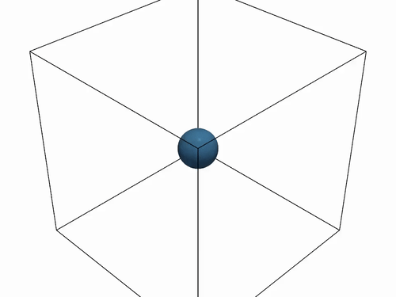
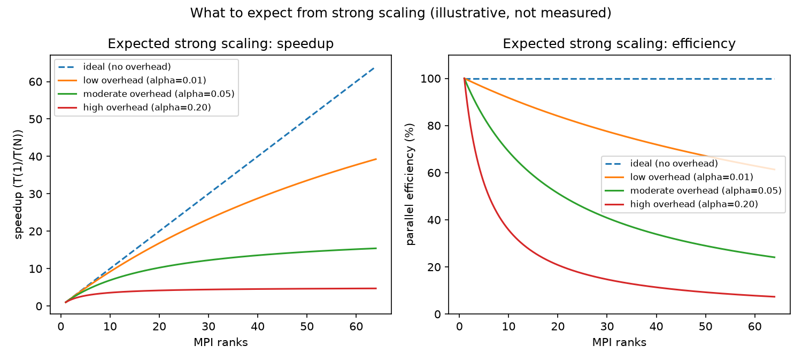

# Tutorial: 3D MPI strong scaling

Task 0004 built the first MPI domain-decomposition prototype (1D slab
along X) and a communication-only benchmark. Task 0005 generalized that
to full 3D block decomposition (`grid/partition/cartesian_partition.hpp`,
`grid/boundary/mpi_halo_boundary.hpp`). This tutorial is the
full-solver demonstration both were building toward: the same
`FvmSolver` + `ScalarAdvectionField<Scalar,3>` + SSP-RK2 stack every
other scalar-advection tutorial/test in this repo uses, run at a fixed
global resolution across an increasing MPI rank count.

## What is strong scaling?

**Strong scaling** fixes the total amount of work (here: one 128^3
grid, one initial condition, one final time -- identical across every
run) and asks: does splitting that *same* fixed pile of work across
more MPI ranks finish it faster? This is different from **weak
scaling**, which grows the problem size *along with* the rank count so
each rank's own share of the work stays the same size -- weak scaling
asks "can we solve a bigger problem in the same time with more
hardware?", not "can we solve this problem faster?". This tutorial
demonstrates strong scaling specifically: `(px,py,pz)` -- how many ranks
sit along each axis -- changes with the rank count, but `global_n=128`
never does.

## What it does

A Gaussian bump (`state = 1.0 + 0.5*exp(-r^2/(2*0.08^2))`, same
convention `tutorials/scalar_advection_3d_visualization/` uses)
translates diagonally (`velocity=(1,1,1)`) across a periodic 128^3
grid for a fixed final time, decomposed across however many MPI ranks
the binary is launched with via `CartesianPartition` +
`MpiHaloBoundary` (task 0005). `(px,py,pz)` is chosen automatically
from the rank count (most "cube-like" factorization -- e.g. 1 rank ->
1x1x1, 2 -> 2x1x1 or 1x1x2, 4 -> 2x2x1, 8 -> 2x2x2).

Each rank writes **its own local block only** as a separate VTK file
(`frame_NNNN_rankNN.vtk`) using its true physical origin -- these tile
together exactly (verified numerically: at 8 ranks, each piece is a
64^3-cell block at one of the 8 corners of the unit cube, with no gaps
or overlaps) when all loaded together in ParaView.

Wall-clock time for the whole run (compute + periodic VTK writes,
synchronized with `MPI_Barrier` so every rank starts the timed region
together) is printed as one CSV row per invocation:
`ranks,px,py,pz,global_n,n_steps,wall_clock_s`.

## Build and run

Requires `-DCFE_ENABLE_MPI=ON` (see repo root `README.md`/`CMakeLists.txt`
for the MPI auto-detect/gate pattern).

```bash
cmake -S . -B build -DCMAKE_BUILD_TYPE=Release -DCFE_ENABLE_MPI=ON
cmake --build build --target cfe_mpi_scalar_advection_3d -j
```

## Running in parallel

This is an ordinary MPI program: launch it with `mpirun` (or `mpiexec`,
or `srun` on a Slurm cluster -- see task 0004's own notes in
`docs/adr/0009-mpi-domain-decomposition.md` on cluster-specific launch
quirks) and the `-n` flag picks the rank count. One run, by itself,
looks like this:

```bash
mpirun -n 4 build/tutorials/mpi_scalar_advection_3d_strong_scaling/cfe_mpi_scalar_advection_3d
```

`(px,py,pz)` -- how the 128^3 global grid is split into a 3D grid of
ranks -- is chosen automatically from whatever rank count `-n` gives it
(see "What it does" above); you do not pick it yourself. If your
machine has fewer physical/logical cores than the rank count you ask
for, add `--oversubscribe` (OpenMPI) so `mpirun` doesn't refuse to
launch more ranks than it thinks you have cores -- this doesn't change
the *result* (every rank still computes and communicates correctly,
just competing for the same core), only the wall-clock timing, which is
why the strong-scaling sweep below should ideally be run on a machine
with at least as many cores as the largest rank count tested.

**To actually measure strong scaling** (the point of this tutorial),
run that same command at several different `-n` values and compare the
reported wall-clock time across them -- a single run, by itself, only
tells you "it works," not "it scales." The loop below does exactly
that and collects the result into one CSV:

```bash
cd tutorials/mpi_scalar_advection_3d_strong_scaling
mkdir -p data
for np in 1 2 4 8; do
  mpirun -n $np ../../build/tutorials/mpi_scalar_advection_3d_strong_scaling/cfe_mpi_scalar_advection_3d \
    > /tmp/run_np${np}.out
  if [ "$np" -eq 1 ]; then
    grep -A1 '^ranks' /tmp/run_np${np}.out > data/summary.csv
  else
    grep -A1 '^ranks' /tmp/run_np${np}.out | tail -1 >> data/summary.csv
  fi
done
```

## Regenerating the figures

```bash
python3 -m venv .venv && source .venv/bin/activate  # optional but recommended
pip install numpy pandas matplotlib
python3 plot_results.py
```

Writes `figures/expected_scaling_reference.png` (see "What to expect"
below -- this one is produced even if `data/summary.csv` doesn't exist
yet, since it isn't derived from any measurement), plus, once
`data/summary.csv` exists, `figures/strong_scaling_time.png`
(wall-clock vs. rank count, log-log, against an ideal `T(1)/ranks`
reference line) and `figures/strong_scaling_speedup.png` (speedup and
parallel efficiency).

## Isosurface video



*(animated GIF for inline playback here -- GitHub strips raw `<video>`
tags from committed README files, so a GIF is what actually autoplays
in this view; the full-quality source is `figures/isosurface.mp4`,
linked again below)*

[**Download/view the full-quality MP4**](figures/isosurface.mp4) (the
GIF above is a lower-quality copy made specifically so it autoplays
inline on this page).

```bash
python3 -m venv .venv && source .venv/bin/activate  # optional but recommended
pip install pyvista imageio imageio-ffmpeg
python3 render_isosurface_video.py
```

Writes `figures/isosurface.mp4` (`ffmpeg -i figures/isosurface.mp4
-vf "fps=10,scale=500:-1:flags=lanczos,split[s0][s1];[s0]palettegen[p];
[s1][p]paletteuse" -loop 0 figures/isosurface.gif` makes the GIF copy
above from it): every rank's VTK tile, every frame, stitched back into
one full-domain grid, one isosurface extracted via VTK's marching-cubes
filter (through PyVista) at a threshold held fixed across the whole
run, viewed from a slowly-orbiting camera positioned outside the
simulated cube. Watch for the surface staying a **rigid, undeformed
sphere** throughout -- only its *position* moves, translating
diagonally and wrapping once it crosses a periodic boundary. That's the
whole point of the contrast with the sibling Burgers tutorial's own
video, where the same starting shape visibly steepens and deforms:
this equation is linear, so nothing about the shape itself ever
changes, no matter how long the run goes.

Requires `vtk_output/` to exist first (run the binary -- any rank count
works, the result is bit-identical regardless of how many ranks ran it).

## What to expect

Before looking at this tutorial's own measured numbers, it helps to
know what strong scaling *in general* looks like, and why it's never
perfectly linear in practice:



This is a **conceptual reference, not measured data** -- a standard
textbook model (`efficiency(N) = 1 / (1 + alpha*(N-1))`, where `alpha`
is the fraction of each rank's time spent on communication/overhead
rather than useful computation). The further `alpha` is from zero, the
sooner speedup levels off and adding more ranks stops helping much.
Every real strong-scaling curve (including this tutorial's own, below)
sits somewhere between the "ideal" dashed line and one of these
overhead curves -- never above the ideal line, and further below it as
communication cost becomes a larger fraction of a shrinking per-rank
workload.

## What the numbers show

| Machine | 1 rank | 2 ranks | 4 ranks | 8 ranks |
|---|---|---|---|---|
| This dev laptop (Apple Silicon, 10 cores, `mpirun --oversubscribe`) | 8.70 s | 4.69 s (1.85x) | 3.33 s (2.61x) | 3.84 s (2.26x) |
| **PSC Bridges-2 (RM-shared, dedicated cores)** | **57.55 s** | **29.26 s (1.97x)** | **14.74 s (3.90x)** | **7.56 s (7.61x)** |

The committed `data/summary.csv` and `figures/*.png` are the **Bridges-2
numbers** -- the authoritative result. Bridges-2 shows **near-ideal
strong scaling all the way to 8 ranks**: 97-98% parallel efficiency at
2 and 4 ranks, still 95% at 8 (`speedup(N)/N`, where 100% would be
perfect linear speedup). This is the textbook strong-scaling result
this tutorial sets out to demonstrate.

**The dev laptop's numbers tell a different, also-instructive story**:
scaling improves up to 4 ranks, then falls off (and even regresses
slightly at 8). This is expected, not a bug in either run: as rank
count grows, each rank's own local block shrinks (at 8 ranks, each owns
only a 64^3 slice of the original 128^3 domain), so the fraction of
total work spent on halo exchange (communication) relative to interior
computation grows -- exactly the overhead
`benchmarks/mpi/bench_mpi_halo_exchange.cpp` (task 0004) already
measured in isolation. On Bridges-2's dedicated cores that overhead is
still small relative to compute at these rank counts (hence the
near-ideal curve); on a laptop sharing its memory bus and cores with
everything else running on it (and, on Apple Silicon, a mix of
performance and efficiency cores), that same overhead is relatively
more significant and noisier -- a direct, measured illustration of why
"verify locally, then confirm on dedicated hardware" (the pattern every
GPU benchmark in this repo already follows) matters: the laptop curve
alone would have suggested this solver stops scaling well past 4 ranks,
which the real cluster data shows is not actually true.

## What is committed vs. regenerated

`data/summary.csv` (tiny, just the four measured rows), all three
PNGs under `figures/` (including the data-independent
`expected_scaling_reference.png`), `figures/isosurface.mp4` (full
quality), and `figures/isosurface.gif` (the lower-quality copy that
actually autoplays inline in this README on GitHub -- raw `<video>`
tags are stripped from committed README files, so a GIF is the only
format that renders playing without an extra click) are all committed
in full -- small enough to commit directly so the videos are viewable
right from the README with no local setup. The VTK frames themselves
are **not** committed (even the smallest, 1-rank case would be ~20
ASCII files per run) -- regenerate
them by running the binary once; they are for interactive viewing in
ParaView if you want to look around yourself, not for this
README to embed.

## Things to try

- **Change `kGlobalN`** (`mpi_scalar_advection_3d.cpp`) -- a larger
  global grid raises the interior-work-to-halo-exchange ratio, which
  should push the point of diminishing returns to a higher rank count.
- **Change `kFinalTime`/`kCfl`** -- more steps means more halo
  exchanges for the same interior work per step, so communication
  overhead (and the point where scaling falls off) becomes relatively
  more significant with a longer run at the same resolution.
- Compare this tutorial's numbers directly against task 0004's
  `bench_mpi_halo_exchange` sweep at a similar cross-section size --
  the fraction of this tutorial's wall-clock time explainable by
  communication alone is a direct, measured answer, not a guess.

## Where to go next

- For the decomposition machinery this tutorial is built on:
  `src/cfe/grid/partition/cartesian_partition.hpp`,
  `src/cfe/grid/boundary/mpi_halo_boundary.hpp`.
- For the correctness proof that decomposition changes nothing about
  the answer: `tests/mpi/test_mpi_halo_exchange_3d.cpp`.
- For the communication-only cost in isolation:
  `benchmarks/mpi/bench_mpi_halo_exchange.cpp`.
- For the scheme-choice rationale (1D slab -> full 3D block
  decomposition, why no diagonal/corner exchange is needed):
  `docs/adr/0009-mpi-domain-decomposition.md`.
